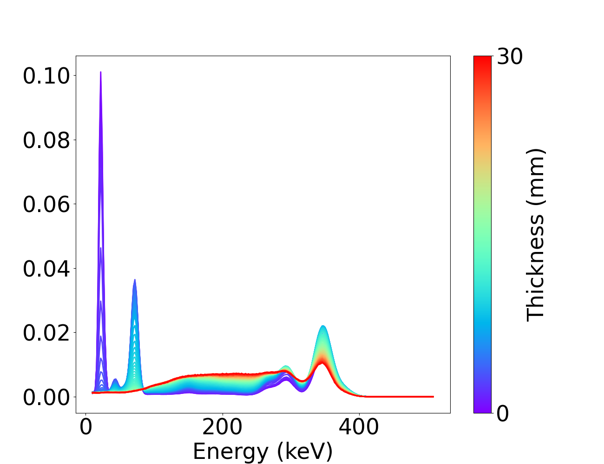
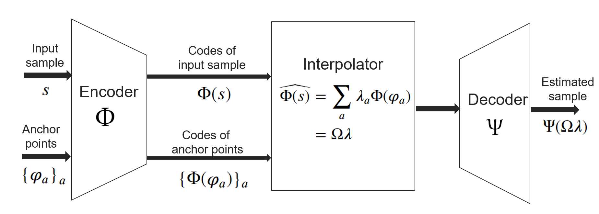
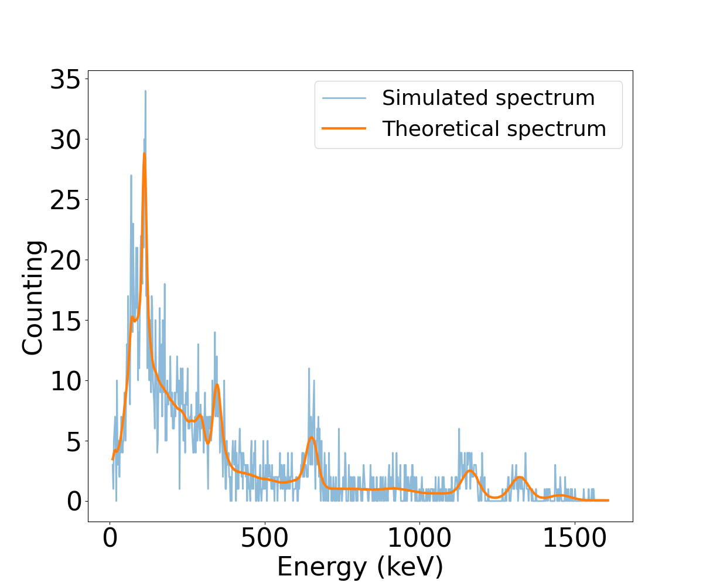
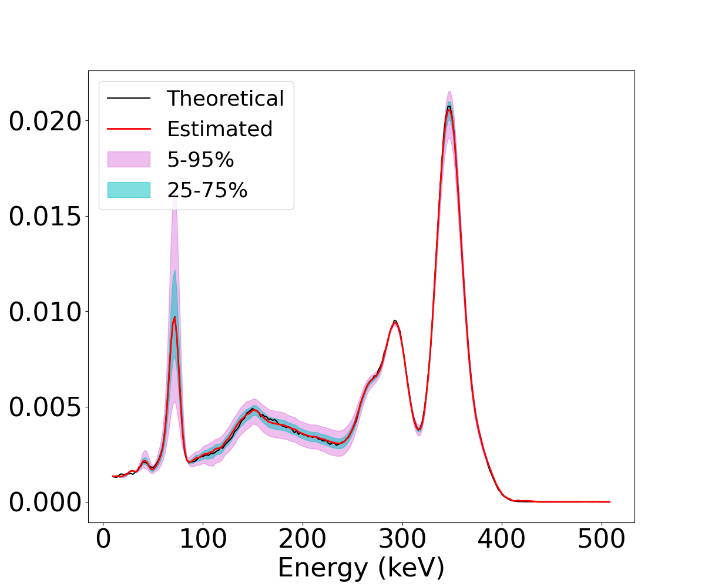

# Semi-blind Spectral unmixing based on manifold learning (SemSun)
This is the code for spectral unmixing of gamma-spectrometry with spectral deformation.
Gamma-spectrum can be deformed by the physical phenomena like attenuation, Compton scatering and fluorescence. The database used in this paper contain different spectrum caractiristic for each radionuclide (called spectral signature) based on a sphere of steel with different thickness.
When thickness is varied, the spectral signatures of all radionuclides are deformed. for example, the figure below represents the evolution of spectral signature of $'^{133}'$Ba in function of thickness.

The main idea of this algorithme is to use a particulier Machine learning model, called IAE, to model the spectral deformation. The key of this method is to use the non linear interpolation of pre-defined points (called anchor points) to describe the spectral signature.

In this work, the IAe model is based on CNN architecture. Two versions of IAE model are proposed: the individual model that learns independently for each radionuclide and a joint model that captures correlations between the spectral variability for all radionuclides. The IAE_CNN_joint_gamma_spectrometry.ipynb file is an example of using IAE to learn spectral deformations. The source code is in the code folder

When The IAE model are trained to capture the shape and variability of spectral signature of all radionuclides,  they are included in an unmixing procedure as contraints on spectral signatures. From an observed spectrum, the hybrid spectral unmixing jointly estimate the spectral signatures and the counting vector based on likelihood function.
The notebook file Evaluation_unmixing_gamma_spectrometry.ipynb explains how to use this codes to perform spectral unmixing.

For example, the figure below shows a gamma-simulated spectrum of the mixture of 4 radionuclides and natural background (Bkg) in the case of the total counting is 2500 on the full spectrum.

The spectral signatures estimated by the SemSun-j is given in the figure below:

